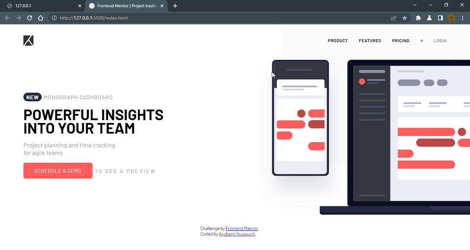

# Frontend Mentor - Project tracking intro component solution

This is a solution to the [Project tracking intro component challenge on Frontend Mentor](https://www.frontendmentor.io/challenges/project-tracking-intro-component-5d289097500fcb331a67d80e). Frontend Mentor challenges help you improve your coding skills by building realistic projects.

## Table of contents

- [Overview](#overview)
  - [The challenge](#the-challenge)
  - [Screenshot](#screenshot)
  - [Links](#links)
- [My process](#my-process)
  - [Built with](#built-with)
  - [What I learned](#what-i-learned)
- [Author](#author)

**Note: Delete this note and update the table of contents based on what sections you keep.**

## Overview

### The challenge

Users should be able to:

- View the optimal layout for the site depending on their device's screen size
- See hover states for all interactive elements on the page
- Create the background shape using code

### Screenshot



### Links

- Live Site URL: [LIVE Site](https://ikuewumi.github.io/fmio-001/)

## My process

### Built with

- Semantic HTML5 markup
- CSS custom properties
- Flexbox
- CSS Grid
- Mobile-first workflow

### What I learned

- This project helped me better my CSS skills by reinforcing the need to write responsive layouts `mobile first` and then add in complexity with media queries

- I also learned about using CSS Grid to create a 'canvas' to position elements without `absolute`

```css
main {
  /*...existing styles*/
  grid-template-areas: "hero";
}

main > * {
  grid-area: hero;
}
```

- There's a really great post out there on using grid-template areas this way by Stephanie Eckles of [ModernCSS.dev](https://moderncss.dev) [here](https://moderncss.dev/3-popular-website-heroes-created-with-css-grid-layout)

## Author

- Github Repository - [Ayobami Ikuewumi](https://github.com/Ikuewumi)
